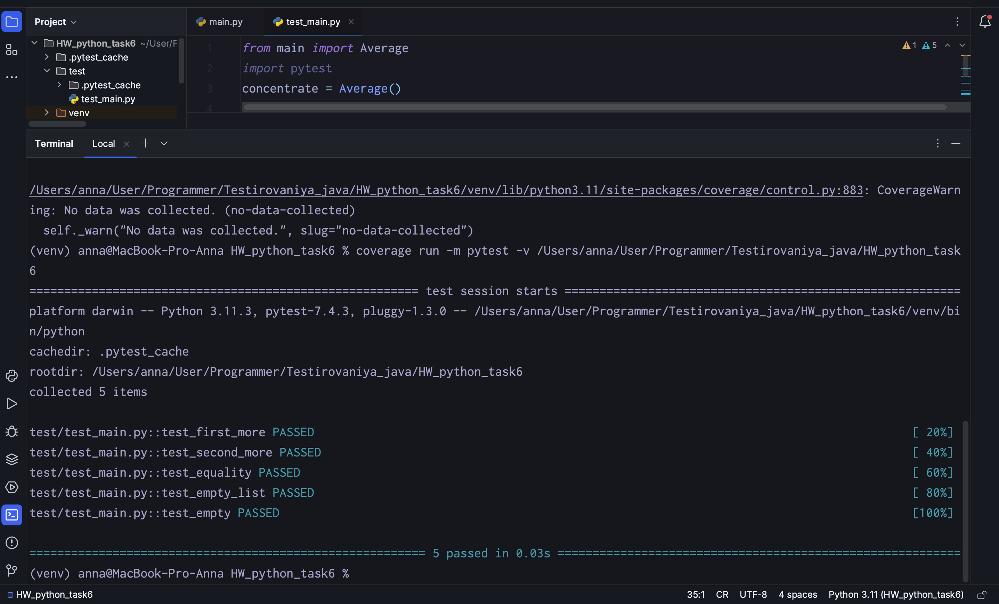

Отчет покрытия тестов


я протестировал следующие сценарии
1. я проверил что первый список больше второго
2. я проверил что второй список больше первого
3. я проверил что списки равны
4. я проверил что возвращает 0 потому что список пуст
5. я проверил корректного расчета среднего значения
